# vLLM OOT Plugin Backend
ATOM can work as the vLLM out-of-tree (OOT) plugin backend. In this design, ATOM is not merged into the vLLM source tree and does not require patching vLLM code. Instead, ATOM is installed as a separate Python package and plugged into vLLM through vLLM's official plugin interfaces. This keeps the integration clean while letting ATOM reuse the mature serving and runtime features already provided by vLLM.

This integration follows the direction described in the [RFC to enable ATOM as a vLLM out-of-tree platform](https://github.com/ROCm/ATOM/issues/201). The high-level idea is that vLLM remains the framework-level runtime, while ATOM focuses on model-level and kernel-level optimization for AMD GPUs. In this mode, ATOM serves as the optimized execution backend and an incubation layer for new kernels, fusions, and model implementations before they are mature enough to be upstreamed.

## What The OOT Design Means
In practice, the responsibilities are split as follows:

| Layer | Responsibility |
|---|---|
| vLLM | API server, CLI, engine, scheduler, worker orchestration, cache management, and framework-level features |
| ATOM | Platform plugin, model registry overrides, model wrappers, attention backends, and the optimized execution path built around ATOM/AITER integrations |
| Integration boundary | vLLM calls the official plugin hooks, while ATOM implements the required platform and model interfaces without changing vLLM source |

This relationship is important: ATOM is not replacing vLLM as a serving framework. Instead, ATOM plugs optimized model execution components into the extension points that vLLM already exposes.

## How The Integration Works
When the `atom` package is installed in the same Python environment as `vllm`, two entry points are exposed following the official vLLM plugin convention:

```toml
[project.entry-points."vllm.platform_plugins"]
atom = "atom.plugin.vllm.register:register_platform"

[project.entry-points."vllm.general_plugins"]
atom_model_registry = "atom.plugin.vllm.register:register_model"
```

During `vllm serve` startup, vLLM scans installed Python packages, loads these entry points, and activates the ATOM hooks:

1. `register_platform()` returns `atom.plugin.vllm.platform.ATOMPlatform`, so vLLM resolves `current_platform` to the ATOM platform.
2. `register_model()` updates selected vLLM `ModelRegistry` entries to ATOM wrappers such as `ATOMForCausalLM` and `ATOMMoEForCausalLM`.
3. When vLLM constructs attention layers, `ATOMPlatform.get_attn_backend_cls()` returns `atom.model_ops.attentions.aiter_attention.AiterBackend` or `atom.model_ops.attentions.aiter_mla.AiterMLABackend`.
4. When a supported model is instantiated, the ATOM wrapper creates the ATOM plugin config, initializes the ATOM/AITER runtime state, and constructs the ATOM model implementation.
5. vLLM continues to drive request scheduling and serving, while the hot model execution path runs through ATOM model code, ATOM attention backends, and AITER-backed kernels.

## Execution flow of vLLM + ATOM


The animation follows the OOT execution flow from server startup to one model execution step:

- `vllm serve` starts the server and initializes plugin loading
- vLLM loads the OOT platform plugin and `register_platform()` returns `ATOMPlatform`
- vLLM loads the general plugin and `register_model()` injects the ATOM model wrappers into `ModelRegistry`
- during model construction, vLLM asks `ATOMPlatform.get_attn_backend_cls()` for the attention backend
- `ATOMModelWrapper` constructs the ATOM model, loads weights, and follows the ATOM compile policy
- after startup, each serving step builds attention metadata, runs `model.forward()`, and then `model.compute_logits()`

## Key Modules In This Integration
- `atom.plugin.vllm.register` - vLLM plugin entry points for platform and model registration
- `atom.plugin.vllm.platform` - the ATOM platform class exposed to vLLM
- `atom.plugin.vllm.model_wrapper` - ATOM model wrappers used by vLLM model construction
- `atom.model_ops.attentions.aiter_attention` - ATOM MHA attention backend for vLLM plugin mode
- `atom.model_ops.attentions.aiter_mla` - ATOM MLA attention backend for vLLM plugin mode

## Supported Models
The current OOT model wrapper supports the following model architectures:

| HF architecture | ATOM model implementation | Model family example |
|---|---|---|
| `Qwen3ForCausalLM` | `atom.models.qwen3.Qwen3ForCausalLM` | Qwen3 dense |
| `Qwen3MoeForCausalLM` | `atom.models.qwen3_moe.Qwen3MoeForCausalLM` | Qwen3 MoE |
| `GptOssForCausalLM` | `atom.models.gpt_oss.GptOssForCausalLM` | GPT-OSS |
| `DeepseekV3ForCausalLM` | `atom.models.deepseek_v2.DeepseekV3ForCausalLM` | DeepSeek-R1 / DeepSeek V3 / Kimi-K2 style models |
| `Glm4MoeForCausalLM` | `atom.models.glm4_moe.Glm4MoeForCausalLM` | GLM-4-MoE |

`Kimi-K2` is also supported. Although it is usually loaded with `--trust-remote-code`, it shares the same DeepSeek-style MLA+MoE architecture path and reuses `atom.models.deepseek_v2.DeepseekV3ForCausalLM` in the ATOM vLLM OOT backend.

## Preparing Environment For vLLM With ATOM Plugin Backend
Pull the docker image for vLLM with ATOM Plugin Backend. The docker image is automatically released on the ATOM side.

```bash
docker pull rocm/atom-dev:vllm-latest
```

If you need an OOT docker image for a specific vLLM version or a specific release date, browse the available tags on [Docker Hub](https://hub.docker.com/r/rocm/atom-dev/tags) and pull the exact tag you need there. For example, to pull the OOT docker adapted to vLLM `0.17.0` on `2026-03-15`:

```bash
docker pull rocm/atom-dev:vllm-v0.17.0-nightly_20260315
```

### Launching Server Of vLLM With ATOM OOT Plugin Platform
There is no code change required on the vLLM side, so you can launch the vLLM server as usual without introducing any ATOM-specific CLI argument.

The vLLM OOT plugin backend keeps the standard vLLM CLI, server APIs, and general usage flow compatible with upstream vLLM. For general server options, OpenAI-compatible API usage, and client patterns, refer to the [official vLLM documentation](https://docs.vllm.ai/en/latest/).

```bash
model_path=<your model file path>

vllm serve $model_path \
    --host localhost \
    --port 8000 \
    --tensor-parallel-size 8 \
    --enable-expert-parallel \
    --trust-remote-code \
    --gpu_memory_utilization 0.9 \
    --async-scheduling \
    --compilation-config '{"cudagraph_mode": "FULL_AND_PIECEWISE"}' \
    --kv-cache-dtype fp8 \
    --no-enable-prefix-caching \
    2>&1 | tee log.serve.log &
```

### Optional: Enable Profiling
If you want to collect profiles, add `--profiler-config "$profiler_config"` to the `vllm serve` command above.

```bash
profiler_dir=./

profiler_config=$(printf '{"profiler":"torch","torch_profiler_dir":"%s","torch_profiler_with_stack":true,"torch_profiler_record_shapes":true}' \
    "${profiler_dir}")
```

If your model has not been downloaded yet, use the following command to download the model weights inside the container first:

```bash
hf download <your model name> --local-dir <your model file path>
```

If you want to disable the ATOM OOT plugin platform and model registration, you can use the following env flag. The default value is `0`:

```bash
export ATOM_DISABLE_VLLM_PLUGIN=1
```

If you only want to disable the ATOM attention backend, you can use the following env flag. The default value is `0`. In most cases, it is not recommended to disable the ATOM attention backend:

```bash
export ATOM_DISABLE_VLLM_PLUGIN_ATTENTION=1
```

### Launching Client For Validating Accuracy
After the server is launched, you can begin your workloads. Here is an example for validating accuracy:

```bash
addr=localhost
port=8000
url=http://${addr}:${port}/v1/completions
model=<your model file path>
task=gsm8k
lm_eval --model local-completions \
        --model_args model=${model},base_url=${url},num_concurrent=16,max_retries=3,tokenized_requests=False \
        --tasks ${task} \
        --num_fewshot 3 \
        2>&1 | tee log.lmeval.log
```

## Limitations
- Data parallelism in the OOT path has not been fully validated yet and may not be mature enough for all scenarios.
- Multi-modal models are not supported by the current OOT integration.
